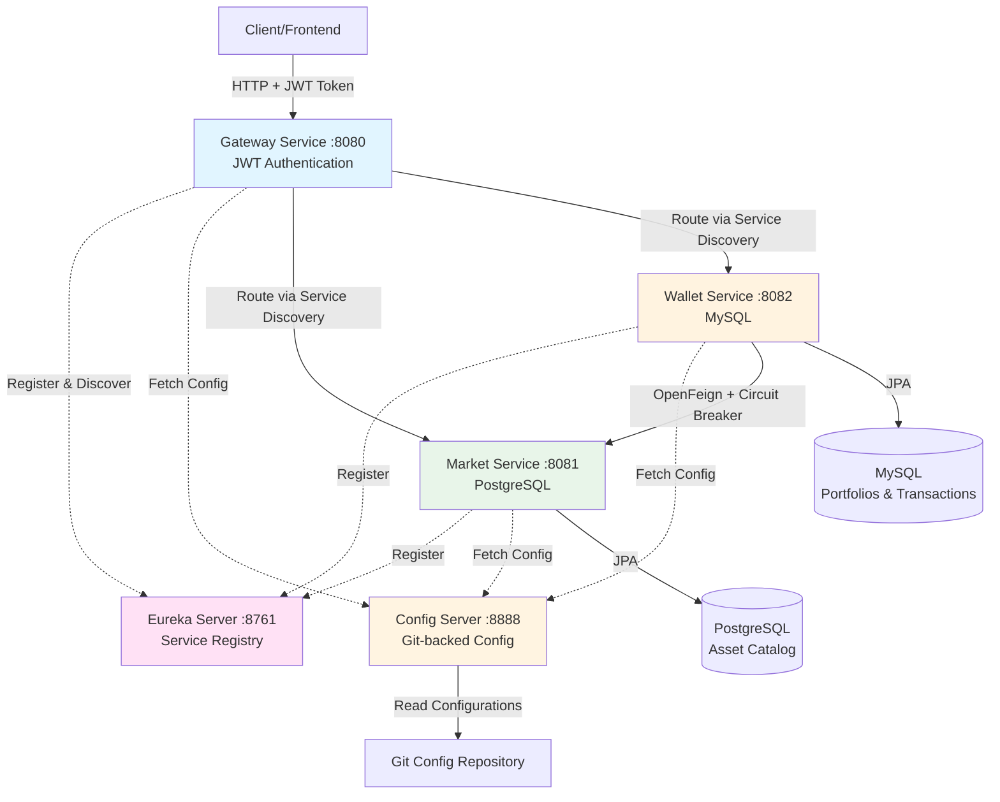

# InvestTrack - Financial Portfolio Management System

A production-ready microservices-based platform for managing financial portfolios with Spring Cloud infrastructure, service discovery, centralized configuration, and JWT authentication.

## 🏗️ Architecture Overview



## 🎯 Key Features

### ✅ Spring Cloud Infrastructure
- **Config Server**: Centralized configuration management with Git backend
- **Eureka Server**: Service registry and discovery
- **API Gateway**: Single entry point with JWT authentication
- **Actuator**: Health and metrics monitoring on all services

### ✅ Microservices
1. **Market Service** (PostgreSQL)
   - CRUD operations for financial assets (stocks, crypto, commodities)
   - Manual price updates
   - Asset catalog management

2. **Wallet Service** (MySQL)
   - User portfolio management
   - Buy/Sell transactions
   - **OpenFeign** client for Market Service communication via Eureka
   - **Resilience4j Circuit Breaker** for fault tolerance
   - **Configurable transaction history** filtering (`invest-config.wallet.history-days`)

3. **Gateway Service**
   - JWT-based authentication
   - Dynamic routing via service discovery
   - CORS configuration

### ✅ Technical Stack
- **Java 17**
- **Spring Boot 3.2.1**
- **Spring Cloud 2023.0.0**
- **PostgreSQL 16**
- **MySQL 8.0**
- **Maven**
- **Docker & Docker Compose**

## 📦 Port Mapping

| Service | Port |  Description |
|---------|------|-------------|
| Gateway Service | 8080 | API Gateway (Single entry point) |
| Market Service | 8081 | Asset management |
| Wallet Service | 8082 | Portfolio & transactions |
| Config Server | 8888 | Configuration management |
| Eureka Server | 8761 | Service registry dashboard |
| PostgreSQL | 5432 | Market Service database |
| MySQL | 3306 | Wallet Service database |

## 🚀 Quick Start

### Prerequisites
- Docker and Docker Compose installed
- Git installed
- 8GB+ RAM recommended

### Installation

1. **Clone the repository**


2. **Verify configuration repository**
```powershell
cd ..\investtrack-config
git log --oneline
cd ..\investtrack
```

3. **Start all services**
```powershell
docker compose up -d
```

4. **Monitor startup logs**
```powershell
docker compose logs -f
```

5. **Verify all services are running**
```powershell
docker compose ps
```

### Access Points

- **Eureka Dashboard**: http://localhost:8761
- **Config Server**: http://localhost:8888
- **API Gateway**: http://localhost:8080
- **Actuator Health Checks**:
  - Config: http://localhost:8888/actuator/health
  - Eureka: http://localhost:8761/actuator/health
  - Market: http://localhost:8081/actuator/health
  - Wallet: http://localhost:8082/actuator/health
  - Gateway: http://localhost:8080/actuator/health

## 📝 API Documentation

### Authentication

#### Login
```bash
curl -X POST http://localhost:8080/api/auth/login \
  -H "Content-Type: application/json" \
  -d '{
    "username": "user1",
    "password": "password"
  }'
```

**Demo Users**:
- `user1` / `password`
- `user2` / `password`
- `admin` / `admin123`

**Response**:
```json
{
  "token": "eyJhbGciOiJIUzI1NiIsInR5cCI6IkpXVCJ9...",
  "username": "user1",
  "message": "Login successful"
}
```

### Market Service (via Gateway)

#### Create Asset
```bash
curl -X POST http://localhost:8080/api/market/assets \
  -H "Authorization: Bearer YOUR_JWT_TOKEN" \
  -H "Content-Type: application/json" \
  -d '{
    "symbol": "AAPL",
    "name": "Apple Inc.",
    "currentPrice": 150.00,
    "type": "STOCK"
  }'
```

#### Get All Assets
```bash
curl http://localhost:8080/api/market/assets \
  -H "Authorization: Bearer YOUR_JWT_TOKEN"
```

#### Get Asset by Symbol
```bash
curl http://localhost:8080/api/market/assets/symbol/AAPL \
  -H "Authorization: Bearer YOUR_JWT_TOKEN"
```

#### Update Asset Price
```bash
curl -X PATCH http://localhost:8080/api/market/assets/1/price \
  -H "Authorization: Bearer YOUR_JWT_TOKEN" \
  -H "Content-Type: application/json" \
  -d '{
    "currentPrice": 155.50
  }'
```

### Wallet Service (via Gateway)

#### Buy Asset
```bash
curl -X POST http://localhost:8080/api/wallet/trade \
  -H "Authorization: Bearer YOUR_JWT_TOKEN" \
  -H "Content-Type: application/json" \
  -d '{
    "userId": "user1",
    "assetSymbol": "AAPL",
    "quantity": 10,
    "type": "BUY"
  }'
```

#### Sell Asset
```bash
curl -X POST http://localhost:8080/api/wallet/trade \
  -H "Authorization: Bearer YOUR_JWT_TOKEN" \
  -H "Content-Type: application/json" \
  -d '{
    "userId": "user1",
    "assetSymbol": "AAPL",
    "quantity": 5,
    "type": "SELL"
  }'
```

#### Get User Portfolio
```bash
curl http://localhost:8080/api/wallet/user/user1 \
  -H "Authorization: Bearer YOUR_JWT_TOKEN"
```

#### Get Transaction History (Filtered by config)
```bash
# Returns transactions from the last N days (configured via invest-config.wallet.history-days)
curl http://localhost:8080/api/wallet/user/user1/transactions \
  -H "Authorization: Bearer YOUR_JWT_TOKEN"
```

## ⚙️ Configuration

### Mandatory Configuration Variable

The transaction history filter is configured in `investtrack-config/wallet-service.properties`:

```properties
# Returns transactions from the last 30 days
invest-config.wallet.history-days=30
```

To change this:
1. Edit the file in the config repository
2. Commit the change:
   ```bash
   cd ..\investtrack-config
   git add wallet-service.properties
   git commit -m "Update history days"
   ```
3. Restart Wallet Service or use Spring Cloud Bus for dynamic refresh

### Circuit Breaker Configuration

Resilience4j settings in `wallet-service.properties`:

```properties
resilience4j.circuitbreaker.instances.marketService.sliding-window-size=10
resilience4j.circuitbreaker.instances.marketService.failure-rate-threshold=50
resilience4j.circuitbreaker.instances.marketService.wait-duration-in-open-state=10000
```

## 🧪 Testing Guide

### 1. Test Circuit Breaker

**Stop Market Service**:
```powershell
docker compose stop market-service
```

**Try to buy an asset** (should get fallback response):
```bash
curl -X POST http://localhost:8080/api/wallet/trade \
  -H "Authorization: Bearer YOUR_JWT_TOKEN" \
  -H "Content-Type: application/json" \
  -d '{
    "userId": "user1",
    "assetSymbol": "AAPL",
    "quantity": 10,
    "type": "BUY"
  }'
```

**Expected Response**:
```json
{
  "success": false,
  "message": "Market Service is currently unavailable. Please try again later.",
  "wallet": null,
  "transaction": null
}
```

**Restart Market Service**:
```powershell
docker compose start market-service
```

### 2. Test Transaction History Filtering

1. Create multiple transactions over time
2. Modify `invest-config.wallet.history-days` in the config repository
3. Commit changes
4. Restart Wallet Service
5. Query transaction history to see filtered results

### 3. Test Service Discovery

1. Open Eureka dashboard: http://localhost:8761
2. Verify all services are registered
3. Stop a service and watch it deregister
4. Restart and watch it re-register

## 🛠️ Development

### Build Individual Services

```powershell
# Market Service
cd market-service
mvn clean package
cd ..

# Wallet Service
cd wallet-service
mvn clean package
cd ..

# Gateway Service
cd gateway-service
mvn clean package
cd ..
```

### Rebuild and Restart
```powershell
docker compose down
docker compose build
docker compose up -d
```

### View Logs
```powershell
# All services
docker compose logs -f

# Specific service
docker compose logs -f market-service
docker compose logs -f wallet-service
```

## 📊 Monitoring

### Health Checks

All services expose Actuator health endpoints:

```bash
curl http://localhost:8080/actuator/health  # Gateway
curl http://localhost:8081/actuator/health  # Market
curl http://localhost:8082/actuator/health  # Wallet
curl http://localhost:8888/actuator/health  # Config
curl http://localhost:8761/actuator/health  # Eureka
```

### Metrics

```bash
curl http://localhost:8081/actuator/metrics
curl http://localhost:8082/actuator/metrics
```

## 🐛 Troubleshooting

### Services won't start
```powershell
# Check logs
docker compose logs

# Restart specific service
docker compose restart market-service

# Full reset
docker compose down -v
docker compose up -d
```

### Config Server can't find Git repository
```powershell
# Verify config repo exists
cd ..\investtrack-config
git status

# Check Config Server logs
docker compose logs config-server
```

### Circuit Breaker not working
```powershell
# Check Wallet Service logs for Resilience4j messages
docker compose logs wallet-service | findstr "Circuit"

# Verify Market Service is down
docker compose ps market-service
```

## 📁 Project Structure

```
investtrack/
├── config-server/          # Centralized configuration
├── eureka-server/          # Service registry
├── market-service/         # Asset catalog (PostgreSQL)
├── wallet-service/         # Portfolio management (MySQL)
├── gateway-service/        # API Gateway + JWT
├── docker-compose.yml      # Docker orchestration
└── .env                    # Environment variables

investtrack-config/         # Git configuration repository
├── application.properties
├── market-service.properties
├── wallet-service.properties
└── gateway-service.properties
```

## 🎓 Learning Resources

- [Spring Cloud Config](https://spring.io/projects/spring-cloud-config)
- [Netflix Eureka](https://spring.io/guides/gs/service-registration-and-discovery/)
- [Spring Cloud Gateway](https://spring.io/projects/spring-cloud-gateway)
- [Resilience4j](https://resilience4j.readme.io/)
- [OpenFeign](https://spring.io/projects/spring-cloud-openfeign)

## 📄 License

MIT License - feel free to use this project for learning and development.

---

**Built with ❤️ using Spring Cloud Microservices Architecture**
